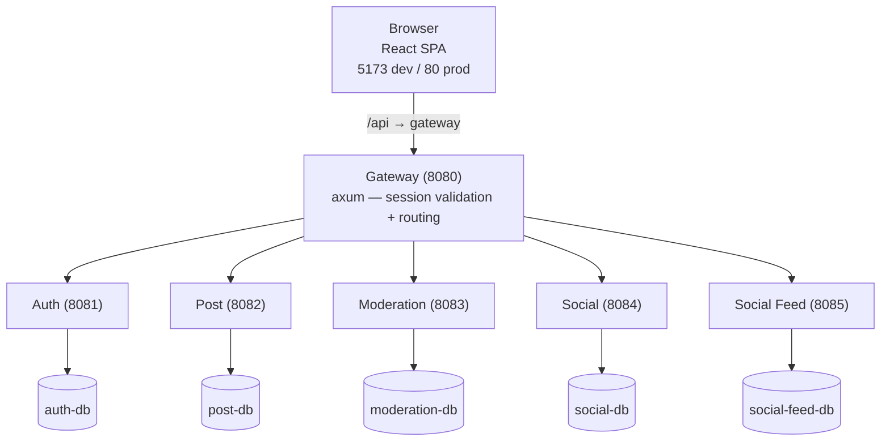

# TwoMice

**Anonymous imageboard-style social media — where identity is earned, not assumed.**

TwoMice combines the topic-focused discussion of imageboards with a friendship layer that makes identity optional. Everyone is anonymous by default — your profile, username, and post history are invisible until a mutual friend request is accepted by both sides.

## Features

<table>
<tr>
<td width="50%">

**Anonymous by default**
Usernames, profiles, and post histories are hidden from everyone. You're just another voice in the thread.

</td>
<td width="50%">

**Earned identity**
Friendship is mutual — only when both sides accept does either person's identity become visible to the other.

</td>
</tr>
<tr>
<td>

**Imageboard structure**
Boards → Posts → Comments → Replies, with upvotes and downvotes throughout.

</td>
<td>

**Moderation tools**
Reports, mutes, bans, thread locks, post deletion, and a full moderation log accessible from an admin panel.

</td>
</tr>
</table>

## Architecture

Six independent Rust microservices, each with its own PostgreSQL database. The React frontend talks only to the API gateway, which validates sessions and routes requests.

| Service | Port | Responsibility |
|---|---|---|
| `gateway` | 8080 | Single entry point — session validation, token caching, request routing |
| `auth` | 8081 | Accounts, sessions, login/signup/logout |
| `post` | 8082 | Boards, posts, comments, replies, votes |
| `moderation` | 8083 | Reports, moderation actions |
| `social` | 8084 | Friend requests, friendships |
| `social-feed` | 8085 | Board follows, personalized feed |

## Stack

| Layer | Technology |
|---|---|
| Backend | Rust + axum |
| Database | PostgreSQL — one per service, accessed via sqlx with compile-time checked queries |
| Frontend | React 19 + TypeScript + Vite 7 |
| IDs | Snowflake BIGINT (distributed-friendly) |
| Passwords | Argon2id |
| Deployment | Docker Compose + Caddy + GitHub Actions |

## Development

See [DEVELOPMENT.md](DEVELOPMENT.md) for setup instructions, running locally, database migrations, and deployment.
